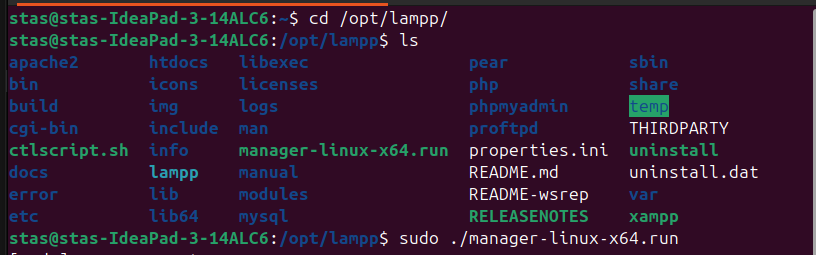
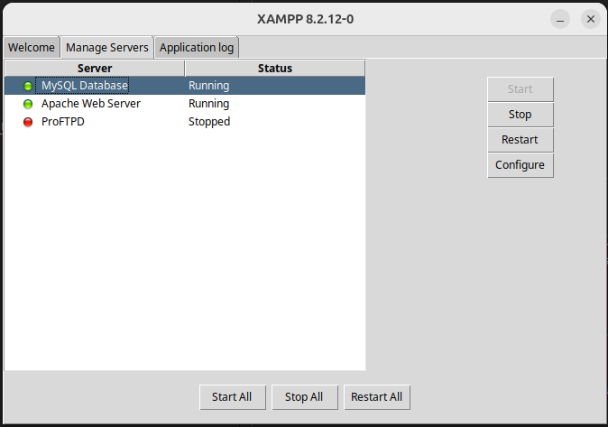

<h1>SMTP mail sender</h1>
<h2>Опис</h2>
Цей веб додаток відправляє через smtp протокол email, а також зберігає   дані в MySQL базу даних, і рендерить сторінку статусу виконання запиту.
<h2>Системні вимоги</h2>
<ul>
<li>Ubuntu 24.04 LTS</li>
<li>Laravel версії 12</li>
<li>XAMPP версії 8.2 12-0</li>
</ul>

<h2>Інструкція з запуску</h2>
<ol>
<li>Зклонувати проєкт</li>
<li>Підняти XAMPP </li>
<li>Запустити Apache і MySQL базу даних </li>
<li>Встановити залежності PHP - composer install</li>
<li>Відкрити проєкт та виконати 'cp .env.example .env' в терміналі</li>
<li>Згенерувати APP_KEY - "php artisan key:generate"</li>
<li>В файлі .env замнінити такі значення: 
- APP_KEY  
- DB_CONNECTION - mysql, та розкоментувати DB_HOST, DB_PORT, DB_DATABASE, DB_USERNAME 
- Замінити MAIL_HOST=smtp.gmail.com 
- MAIL_PORT - 465 
- MAIL_USERNAME - на ваш email через який буде працювати SMTP протокол 
- MAIL_PASSWORD - на ваш пароль додатку 
<li>Відкриваємо додаток через url, який ви указали в APP_URL</li>
</ol>
